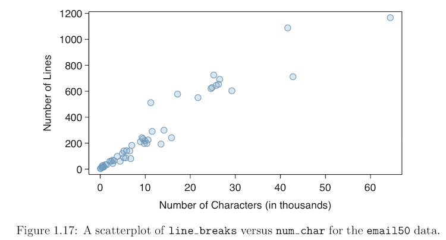

```{r setup, include=FALSE}
library(learnr)
library(tidyverse)
library(ggformula)
library(mosaic)
library(mosaicCore)
library(mosaicData)
library(openintro)
knitr::opts_chunk$set(echo = FALSE)
```


## Background

When it comes to teaching statistics in a data-centric way, StatPREP faces a dilemma. On the one hand, we want to help you get teaching with data as quickly as possible. This suggests helping you teach your *existing* course but with more actual data. On the other hand, we want you to be able to engage data in a modern way by adopting practices that have been fostered by the emergence of data science as a discipline. This suggests discouraging you from continuing to emphasize the many historical practices developed in an era where data and computing were very limited.

Facing this fork in the road ... StatPREP is going both ways! This tutorial is about R commands for making the sorts of graphics traditionally encountered in statistics courses: scatterplots, histograms, box-and-whisker plots, and so on. We have another set of tutorials that take a radically different approach: layers of data graphics, statistical graphics, and inferential graphics.

This tutorial is about conventional graphics. Ideally, in order to help you teach your *existing* course, we would key the conventional graphics to your current textbook. There are too many texts for this to be practical. Instead, we have selected one textbook which is freely available to both students and faculty: [*OpenIntro Statistics*](https://www.openintro.org/stat/textbook.php?stat_book=os) (3rd edition), by Diez, Barr, and Çetinkaya-Rundel. 

### Bells and whistles

Each software package makes choices about defaults: colors to be used, positions of legends, the placement of ticks on axes, and so on. We encourage you to use the defaults for the software introduced below. Otherwise, you are teaching software rather than graphics. Still, we've shown a few customizations to make the plots resemble those in the OpenIntro book.

## Scatterplot 


The `gf_point()` function makes scatterplots. It's two arguments are

* a formula, specifying the y versus x variables: `fed_spend ~ poverty`
* the name of the data frame. OpenIntro provides the data as the `county` frame in the `openintro` package.

```{r fig1.8, exercise=TRUE}
gf_point(fed_spend ~ poverty, data = openintro::county) 
```

```{r fig1.8-solution}
gf_point(fed_spend ~ poverty, data = openintro::county, alpha = 0.2) %>%
  gf_lims(y = c(0,32)) %>%
  gf_labs(y = "Federal Spending Per Capita", x = "Poverty Rate (Percent)")
```

The textbook figure has limited the y-axis to the range 0 to 32 and has different axis labels. You can accomplish this by piping the output of `gf_point()` into two other `gf_` functions:

* Set limits with `gf_lims()`.

* Set axis labels with `gf_labs()`

Bells and whistles:

* The textbook plot has smaller dots than the default from `gf_point()`. Use the `size =` argument to change the dot size. Try `size = 0.5`.
* We'd encourage you to use transparency rather than dot size. This is done with the `alpha =` argument. Try `alpha = 0.2`. 

### Exercise 1

Reconstruct this graphic, which also depicts from the `openintro::county` data frame.


Suggestions:

* Use `names(county)` to find the variable names.

```{r fig1.9, exercise = TRUE}

```

```{r fig1.9-solution}
gf_point(homeownership ~ multiunit, data = openintro::county, alpha = 0.2) %>%
  gf_labs(x = "Percent of Units in Multi-Unit Structures",
          y = "Percent of Homeownership")
```

### Exercise 2

Reconstruct this graphic. All the information needed to identify the data frame and variables is given in the figure caption.




```{r fig1.17, exercise = TRUE}

```

```{r fig1.17-solution}
gf_point(line_breaks ~ num_char, data = openintro::email50, alpha = 0.5) %>%
  gf_labs(x = "Number of Characters (in thousands)",
          y = "Number of Lines")
```

## Histogram


Histograms are made with `gf_histogram()`. A minimum of two arguments are needed:

* A one-sided formula specifying the variable to be used on the x-axis.
* The data frame

```{r fig1.22, exercise = TRUE}
gf_histogram( ~ num_char, data = openintro::email50)
```

The default graphic differs from the textbook version in several ways: the labels on the x- and y-axes, the positioning of the histogram bins, and color used to fill the histogram and the outlining of the individual bars. It's probably a bad practice to outline the bars (and even worse to show just the outlines), but we'll take you there. 

* To set the fill color, give `gf_histogram()` an additional argument, `fill = "cadetblue1"`.
* To show the bar boundaries, give `gf_histogram()` the argument, `color = "black"`. 
* To set the bins to start at zero and have width 5, use the argument `binwidth = 5`.
* By centering the first bin at 2.5, the bin will start at 0. `center = 2.5`.

```{r fig1-22-solution}
gf_histogram( ~ num_char, data = openintro::email50,
              fill = "deepskyblue4",
              color = "black",
              binwidth = 5,
              center = 2.5) %>%
  gf_labs(x = "Number of Characters (in thousands)", y = "Frequency")
```

## Bar charts of counts

Bar charts are very much like histograms, but a categorical variable is on the x-axis and the bars do not touch. Bar charts of counts (the left figure) are made with `gf_counts()`. Bar charts of proportions with `gf_proportions()`.


```{r fig1.35, exercise = TRUE}
gf_counts( ~ number, data = openintro::email50)
```

```{r fig1.35-solution}
gf_counts( ~ number, data = openintro::email50, 
           fill = "deepskyblue4", color = "black")
gf_props( ~ number, data = openintro::email50,
          fill = "deepskyblue4", color = "black")
```

## Segmented bar charts


Fundamentally, these are bar charts of counts and proportions. So you'll be using the `gf_counts()` function. What's different here is the color fill of the bars. Rather than being a constant (`"deepskyblue4"`), the fill color is being taken from the value of the variable `spam`.

Ordinarily, you would set the fill color with an addition argument: `fill = ~ spam`. Notice that the value for the `fill` argument is a one-sided formula.

Regretably, the `email50` data frame used the numbers 0 & 1 to encode whether the row was spam or not. In making the textbook figure, they did some pre-processing to turn the 0/1 coding to "not spam" and "spam" labels. So we'll do that, too. That's a bit of data wrangling, which isn't the subject of this tutorial, 

```{r fig.1.39, exercise = TRUE}
# Wrangling step
modified_email50 <- email50 %>% mutate(spam = ifelse(spam, "spam", "not spam"))
# Graphics command
gf_counts( ~ number, data = modified_email50, fill = ~ spam)
```

By default, the different colors are stacked on top of one another. You can change the positioning for the colors with the `position =` argument. There are three possible values: `"dodge"`, `"fill"`, and the default `"stack"`. See which one creates the conditional proportions seen in the right panel of Open Intro Figure 1.39.

```{r fig.1.39-solution, exercise = TRUE}
# Wrangling step
modified_email50 <- email50 %>% mutate(spam = ifelse(spam, "spam", "not spam"))
# Graphics command
gf_counts( ~ number, data = modified_email50, fill = ~ spam, position = "fill") 
```

Don't like where the legend is being positioned? Two suggestions:

1. Don't worry about it. You're probably not writing a textbook.
2. If you are finicky about such details, you can use `gf_theme()` to set the details by piping the output of `gf_counts()`
```r
gf_counts( ... the arguments from before ...) %>%
  gf_theme(legend.position = "top")
```
Possible values for `legend.position` are `"top"`, `"left"`, `"right"`, `"bottom"`, `"none"`.

Thinking you absolutely need to do more fidgeting? Is Swedish patriotism driving your graphics: . You can do still more "refinement" ...

```r
... stuff from before ... %>%
  gf_refine(scale_fill_manual(values = c("blue", "yellow")))
```

## Box-and-whisker plots


The data frame depicted in OpenIntro Figure 5.25 is not readily available, but the `openintro::mlbBat10` frame is similar. The variables are `OBP` versus `position`.

```{r fig5.25, exercise = TRUE}
gf_boxplot(OBP ~ position_type, data = openintro::mlbBat10)
```

Note that Figure 5.25 has consolidated the positions into just four categories. This is a data-wrangling operation. See data-wrangling tutorials for further details.

### Pie charts

Really? Read what OpenIntro has to say ...


Need more discouragement? Here's an R-flavored joke courtesy of Yihui Xie:

```{r echo = FALSE}
par(mar = c(0, 1, 0, 1))
pie(
  c(280, 60, 20),
  c('Sky', 'Sunny side of pyramid', 'Shady side of pyramid'),
  col = c('#0292D8', '#F7EA39', '#C4B632'),
  init.angle = -50, border = NA
)
```

If you need to present pie charts in your class, perhaps use images from Google. That, at least, will send a message that a pie chart is not a standard format in statistics. But if you must, note that a pie chart is basically the same as a *single* stacked count or proportion chart.

```{r}
gf_counts( ~ 1, fill = ~ number, data = email50)
```

The formula argument to `gf_counts()` should be enough to tell you that this isn't what you want to do, but continuing onward to morph this plot into a pie, tell R to use radial coordinates:

```{r}
gf_counts( ~ 1, fill = ~ number, data = email50) %>%
  gf_refine(coord_polar(theta = "y")) %>%
  gf_theme(theme_void())
```

## "Simple" regression


The data frame is `openintro::possum` and the variables are `headL` and `totalL`. This is a composite plot in several layers. One layer is an ordinary scatter plot. Another layer is the regression line. (Other layers produce the red annotations, which we'll skip here.) In `gf_` graphics, the layers are produced by different functions.

```{r fig7.7, exercise = TRUE}
gf_point(headL ~ totalL, data = openintro::possum) %>%
  gf_lm()
```

Notice that `gf_lm()` computes the regression line. You might prefer to specify a line in slope-intercept form. Do that with `gf_abline()`, e.g. 
```r
gf_abline(intercept = 100, slope = -0.05, color = "red")
```

### Exercise: Resampling

The `gf_lm()` function can be applied to resampled data to show trials from the sampling distribution on the regression line. Try this, adding in several more resampling trials.

```{r fig7.7-b, exercise = TRUE}
gf_point(headL ~ totalL, data = possum) %>%
  gf_lm() %>%
  gf_lm(data = resample(openintro::possum), color = "red") %>%
  gf_lm(data = resample(openintro::possum), color = "red")
```

And while you're at it, add the argument `interval = "confidence"` to the first `gf_lm()` call.

### Exercise: Nonlinear fits

The OpenIntro book has this warning ...


Replace `gf_lm()` with `gf_smooth()` or `gf_spline()` for a curved trend.

```{r fig7.7-c, exercise = TRUE}
gf_point(headL ~ totalL, data = possum) %>%
  gf_smooth(se = TRUE) %>%
  gf_smooth(data = resample(openintro::possum), color = "red", se = FALSE) %>%
  gf_smooth(data = resample(openintro::possum), color = "red", se = FALSE)
```

Regretably, the `gf_lm()` and `gf_smooth()` functions use different arguments to control whether the confidence interval is shown.

To adjust the smoothness of the function constructed by `gf_smooth()`, use the argument `span =`. The value given `span =` is a number. Try, for instance, `span = 0.5` and `span = 10`. The analogous argument for `gf_spline()` is `df = `. A value 2 gives a straight-line fit. Higher values give potentially curvier fits.

## Coming soon?

### Dotplot with annotation


### Logarithms


### Scatterplot with a smoother

