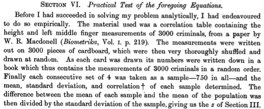

```{r setup, include=FALSE}
library(learnr)
library(mosaic)
library(mosaicCore)
library(ggformula)
library(mosaicData)
library(dplyr)
knitr::opts_chunk$set(echo = FALSE)
Autos <- 
  mtcars %>% mutate(model = rownames(mtcars)) %>%
  filter(!duplicated(disp), !duplicated(mpg), !duplicated(hp)) %>%
  select(model, mpg, cyl, disp, hp) %>%
  head(5)
```

## From Sampling to Resampling

In an [earlier tutorial on sampling](https://dtkaplan.shinyapps.io/Sampling/) we constructed a set of trials. For each trial, we took a data table and drew a random set of $n$ rows, then calculated a *sample statistic* from those random rows. Each of these trials give a *somewhat* different value for the sample statistic. By comparing the results many trials, we can determine the amount of sampling variability among samples of size $n$. One of the lessons from undertaking that process is that trials involving large $n$ tend to have *less* sampling variation that trials with small $n$. The overall pattern is that the amount of sampling variation is proportional to $1/\sqrt{n}$. So, trials with a size $n=100$ will have half the amount of variation as trials with a size of $n = 25$.

In reality, sampling is not performed by the computer from a data table; sampling is carried out by the researchers in the course of collecting data from the population. Those sampling trials were really a computer simulation for the purposes of understanding statistical theory, not a process which is carried out in authentical analysis of data.

In practice, we have just one set of cases selected from the population. From those cases, we need to infer the variation that would have occurred if we collected many samples. It's traditional in textbooks to use probability theory to do this. Although this seems the "correct" mathematical approach it comes with a price:

* There is a limited range of statistics for which the theory has been developed. The familiar statistics from introductory statistics fall into this group: mean, proportion, difference in means, difference in proportions, t, F, $\chi^2$. But there are many problems for which other statistics are better suited. 
* The applicability of the theory can be sensitive to *assumptions* in the derivation that may not be true for the system being studied.
* Students generally do not understand the derivation of this theory, challenging the possibility that they will create a coherent model of the logic behind the statistical procedures they are taught.

Resampling is a simple, practical method for simulating the variability that stems from sampling from the population. Resampling makes random selections from the sample at hand rather than the population. The random draws in resampling are performed with replacement, so that a single case from the sample may appear more than once (or not at all) in the simulated sample.

To illustrate, consider this small sample of automobile models taken from the `mtcars` data table. 


```{r echo = TRUE}
Autos 
```
```{r auto_resample-setup}
Autos <- 
  mtcars %>% mutate(model = rownames(mtcars)) %>%
  filter(!duplicated(disp), !duplicated(mpg), !duplicated(hp)) %>%
  select(model, mpg, cyl, disp, hp) %>%
  arrange(model) %>%
  head(5)
```

Now try resampling from `Autos` by running the following code block. You can run it several times to get an idea of the variability introduced by resampling.

```{r auto_resample, exercise = TRUE}
resample(Autos) 
```

Since the resampling is done randomly, the result will differ from trial to trial. Some trials may include all `r nrow(Autos)` of the original cases, some trials will leave out some of the cases and duplicate others.

## Stable properties of the sampling distribution

In a previous example, we looked at the median of runners' `net` race times in samples of size $n = 100$. Let's do something similar with the median of runners' `age`s in samples of size $n=50$.  The following code block adapts that calculation, displaying the sampling distribution.  Recall: 

- The histogram shows the "shape" of the distribution.

- The `df_stats()` calculation at the end gives the standard error of the median, that is, the standard deviation of distribution of sample medians, as well as the mean of the sampling distribution.

```{r sample_median, exercise = TRUE, out.width = "60%", fig.align = "center"}
Trials <- 
  do(2000) * {
    TenMileRace %>%
      sample_n(size = 50) %>%
      df_stats( ~ age, med = median)
  }

gf_histogram( ~ med, data = Trials) %>%
  gf_lims(x = c(25, 45)) %>%
  gf_labs(title = "Sampling Distribution")

df_stats( ~ med, data = Trials, mean, sd)
```

This is just an estimate of the sampling distribution based on 200 sampling trials. Run the code block *several* times to get a sense of how stable the location of the center and the width of the sampling distribution are.


### Exercise

```{r sampling-stable, echo=FALSE}
question("Which of these statements correctly reflect how the sampling distribution varies from one run to the other? (Width is measured by the standard deviation.)",
  answer("The location of the center of the distribution **and** the width of the distribution.", correct = TRUE),
  answer("The location of the center of the distribution but **not** the width of the distribution.", correct = FALSE, message = "The width is pretty much the same from run to run."),
  answer("The width of the distribution but **not** the location of the center.", correct = FALSE, message = "The center stays very much in the same place over the runs."),
  answer("None of the above", correct = FALSE, message = "No, the different runs of the code block show distributions that are roughly the same shape from run to run, both in terms of the center and width."),
  allow_retry = TRUE
)
```

## Stable properties of the **Resampling** distribution.

Now to work with resampling. Recall that we use resampling to deal with our not having the population readily at hand. Instead, all we have is a single sample of size $n$. The following code block does the following:  

- Generate a single sample.

- Calculate and store the median age of this single sample.  

- Re-sample from this single sample, thus using only this single sample in the variability calculation.  Specifically, take 200 re-samples of size $n=50$ from the single sample.  It's important to note that `sample_n(size = 50)` has been replaced with `resample()`. (By default, `resample` generates output of the same $n$ as the input data table.)

- Plot the medians of the 200 resamples.  Include a red line to emphasize the location of the median of the original single sample.

```{r resample_median, exercise = TRUE, out.width = "60%", fig.align = "center", warning=FALSE}
# Generate the single sample
Single_sample <- TenMileRace %>% sample_n(size = 50)

#Calculate the median age of the single sample
Single_sample_median <- Single_sample %>% df_stats( ~ age, med = median)

# Take 200 resamples from the single sample
Trials_resample <- 
  do(200) * {
      Single_sample %>%
      resample() %>%
      df_stats( ~ age, med = median)
  }

#Plot the resample distribution of medians
gf_histogram( ~ med, data = Trials_resample, bins = 10) %>%
  gf_lims(x = c(25, 45)) %>%
  gf_labs(title = "Resampling Distribution") %>% 
  gf_vline(data = Single_sample_median, xintercept = ~ med, color="red")

df_stats( ~ med, data = Trials_resample, mean, sd)
```

This is just an estimate of the resampling distribution based on 1 single sample from which we take 200 resamples. When you re-run the code block, you'll get a new single sample and new resamples.  Run the code block a few times to get a sense of how stable the location of the center and the width of the resampling distributions are.


### Exercise

```{r resampling-stable, echo=FALSE}
question("Which of these statements correctly reflect how the resampling distribution varies from one run to the other? (Width is measured by the standard deviation.)",
  answer("The location of the center of the distribution **and** the width of the distribution.", correct = FALSE, message = "One of them can vary substantially from run to run"),
  answer("The location of the center of the distribution but **not** the width of the distribution.", correct = FALSE, message = "The center moves around from run to run. "),
  answer("The width of the distribution but **not** the location of the center.", correct = TRUE, message = "This is what resampling is good at: estimating the width of the sampling distribution."),
  answer("None of the above", correct = FALSE, message = "No, the different runs of the code block show distributions that are roughly the same width from run to run."),
  allow_retry = TRUE
)
```

Keep in mind that construction of confidence intervals needs only the *width* of the sampling distribution. The position of the center of a confidence interval is always given by the sample statistic. The sample statistic can be thought of as a draw from the sampling distribution. As such, it's not necessarily in the center of that distribution.


## Some historical background

The use of resampling to estimate standard errors goes by the name **bootstrapping**, which is a standard statistical practice in contemporary statistics.

For many people, their past exposure to estimating standard error comes in terms of formulas like $\sqrt{\frac{s}{n}}$ for the standard error of the sample mean and $\sqrt{\frac{\hat{p} (1-\hat{p})}{n}}$ for the standard error of the sample proportion. (There are similar formulas for the difference of two means or the difference of two proportions.) Since these are expressed in algebraic terms, they give the impression of certainty. 

However useful such formulas may be in simple circumstances, they simply do not apply to many commonly encountered situations. Professional statisticians include resampling in their toolbox, so that they have a ready estimate of the width of sampling distribution for a wider range of statistics.

The formulas are uniquely useful, within their limited domain, when $n$ is very small, say $n \leq 10$. Historically, though, simulation preceeded the construction of formulas. Here, for instance, is an excerpt from "Student's" famous 1908 paper that proposed what we now call the t distribution but that he called "z":

```{r out.width = "80%", fig.align = "center"}

```

Algebraic solutions have always been associated with exactitude. We often forget that framing a question in a manner suited to algebra itself imposes an approximation to the situation in the real world. With algebra, we get an exact solution to a problem that only approximates the problem we want to solve.

In 1936, Ronald Fisher described the problem itself, in the context of a comparison of the heights of Englishmen to that of Frenchmen.

> *Let us suppose, for example, that we have measurements of the stature of a hundred Englishmen and a hundred Frenchmen.*

Keep in mind that the two-hundred measurements, one-hundred from each nationality, constitute *one* sample. We can imagine, however, that we could repeat the process of constructing a sample. Each hypothetical carrying out of that process is one *trial*. Carrying out many such trials generates many samples.

> *[I]f our samples are satisfactory in the manner in which they have been obtained [that is, by random selection from the national population], the further question arises as to whether a difference of the magnitude observed might not have occurred by chance, in samples from populations of the same average height.*
> *It may be asked how we can speak of "how often" a certain average will be recorded in a thousand trials when, in fact, we have only one sample to base our knowledge on. ... The simplest way of understanding quite rigorously, yet without mathematics, what the calculations of the test of significance amount to, is to consider what would happen if our two hundred actual measurements were written on cards, shuffled without regard to nationality, and divided at random into two new groups of a hundred each. This division could be done in an enormous number of ways ... We may suppose that for each of these ways the difference between the two average statures is calculated. ... [If] the two populations were homogeneous, there would be nothing to distinguish the particular subdivision in which the Frenchmen are separated from the Englishmen from among the aggregate of the other possible separations which might have been made [by shuffling the cards].*

So why don't we carry out the calculation this way?

> *Actually, the statistician does not carry out this very simple and very tedious process, but his conclusions have no justification beyond the fact that they agree with those which could have been arrived at by this elementary method.*

It's a matter of avoiding tedium, not that algebra gives a better answer. In the almost 100 years since Fisher wrote, we've developed other ways for avoiding tedium, specifically the use of computers.

